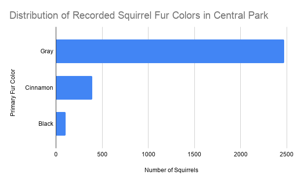
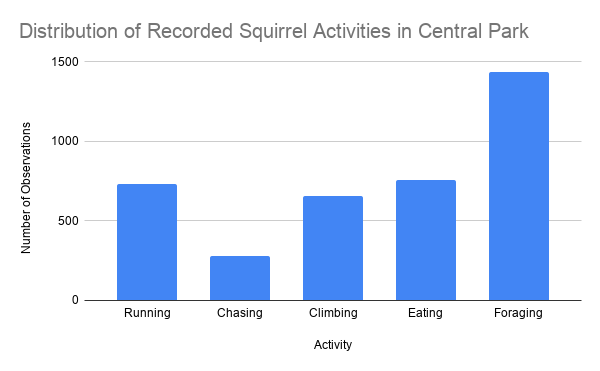

# What Central Park’s Squirrel Census Can and Cannot Tell Us

## Opening Question

A squirrel census sounds a little strange at first. It is not the kind of dataset people usually expect in a data journalism project. But that is why I thought it was interesting. It takes something very ordinary — seeing squirrels in a park — and turns it into structured data.

For this project, I wanted to ask a simple question:

**What can a squirrel census tell us about urban wildlife, and what does it leave out?**

I focused on two parts of the dataset: squirrel fur color and squirrel activity. These are both easy to understand, but they also show an important point about data. The dataset can show what volunteers recorded, but it cannot fully explain squirrel behavior.

## Why This Dataset

The dataset comes from **NYC Open Data**. I used the dataset called **2018 Central Park Squirrel Census - Squirrel Data**.

Original data source: [NYC Open Data, 2018 Central Park Squirrel Census - Squirrel Data](https://data.cityofnewyork.us/Environment/2018-Central-Park-Squirrel-Census-Squirrel-Data/vfnx-vebw/about_data)

Note: GitHub sometimes sends this NYC Open Data link through a redirect that may show a 403 Forbidden page. If that happens, please copy and paste the full URL directly into a browser:

https://data.cityofnewyork.us/Environment/2018-Central-Park-Squirrel-Census-Squirrel-Data/vfnx-vebw/about_data

The dataset has **3,023 squirrel observation records** from Central Park. Each row represents one squirrel observation. The data includes location information, a squirrel ID, age, fur color, and several observed behaviors, including running, chasing, climbing, eating, and foraging.

I chose this dataset because it is unusual but still useful. It is also a good example of citizen science. Volunteers helped collect observations, and those observations became a public dataset that anyone can analyze.

At the same time, this dataset should not be treated as a perfect record of all squirrels in Central Park. It only shows what observers saw during the census. That means it is useful, but limited.

## What I Did With the Data

I used Google Sheets to clean and analyze the dataset.

Google Sheets analysis: [View my analysis spreadsheet](https://docs.google.com/spreadsheets/d/1bRutCOOJJYfrHYNQD-T-vz1_lDhtBH0-fTRTifWo5FE/edit?usp=sharing)

I started by importing the CSV file into Google Sheets. Then I looked through the columns and chose two parts of the dataset that could support clear charts.

For the first chart, I used the **Primary Fur Color** column. I made a pivot table to count how many observations were listed as Gray, Cinnamon, or Black. There were also **55 records with missing primary fur color**, so I did not include those missing values in the chart. I mention them here because missing data is still part of the story.

For the second chart, I did not use a pivot table. The squirrel activities are not stored in one single category column. Instead, they are stored as separate TRUE/FALSE columns, such as **Running**, **Chasing**, **Climbing**, **Eating**, and **Foraging**.

Because of that, I created a separate sheet called **Activity Summary**. In that sheet, I used `COUNTIF` formulas to count how many TRUE values appeared in each activity column. Then I used that summary table to make the second chart.

## Chart 1: Fur Color

**Chart 1. Distribution of recorded squirrel fur colors in Central Park.**  
Source: NYC Open Data, 2018 Central Park Squirrel Census - Squirrel Data. Analysis by author.  
**Key annotation:** Gray was the most common recorded primary fur color, with 2,473 observations.

The first chart shows that most squirrels with a recorded primary fur color were gray. The dataset recorded:

- **2,473 gray squirrels**
- **392 cinnamon squirrels**
- **103 black squirrels**

This is a very uneven distribution. Gray squirrels were not just slightly more common. They made up the large majority of observations with a recorded fur color.

This finding is simple, but it is still useful. It shows how a basic category like fur color can help describe what observers saw in the park. It also raises a small data issue: **55 squirrel records did not have a primary fur color recorded**. Those records are not shown in the chart, but they matter because they show that even a simple field can be incomplete.

## Chart 2: Activity

**Chart 2. Distribution of recorded squirrel activities in Central Park.**  
Source: NYC Open Data, 2018 Central Park Squirrel Census - Squirrel Data. Analysis by author.  
**Key annotation:** Foraging was the most frequently recorded activity, with 1,435 observations.

The second chart shows five recorded squirrel activities:

- Running: **730**
- Chasing: **279**
- Climbing: **658**
- Eating: **760**
- Foraging: **1,435**

Foraging was the most commonly recorded activity. Eating and running were also common, while chasing was recorded much less often.

One important thing is that these categories are not mutually exclusive. One squirrel observation could include more than one activity. For example, a squirrel could be both running and foraging. That is why the y-axis says **Number of Observations**, not number of squirrels.

So this chart should not be read like a pie chart or a perfect breakdown of squirrel behavior. It shows how often each activity was recorded, not what percentage of time squirrels spent doing each thing.

## What the Data Can Show

This dataset is good at showing visible, recorded patterns. It can answer questions like:

- What fur colors were recorded most often?
- Which activities were marked most often by observers?
- How many records are missing certain information?
- What kinds of observations volunteers were able to collect?

For this project, the clearest patterns are that gray squirrels were the most common recorded fur color, and foraging was the most common recorded activity.

## What the Data Cannot Show

The dataset also has clear limits.

First, it is based on human observation. Volunteers could only record what they saw at a particular place and time. If a squirrel was hidden, moving quickly, or hard to see, the record might be incomplete.

Second, the data does not explain why squirrels behaved in certain ways. For example, the data shows that foraging was recorded often, but it does not explain whether that was because of time of day, season, food availability, observer location, or other factors.

Third, some data is missing. The fur color chart leaves out 55 records with no primary fur color listed. That does not ruin the dataset, but it is a reminder that field data is rarely perfect.

Fourth, the activity fields overlap. Running, climbing, eating, and foraging are separate TRUE/FALSE columns, not one single choice. Because of that, the activity chart counts observations of behaviors, not individual squirrels doing only one activity.

## Ethical Concerns and Reporting Process

This dataset does not have the same privacy concerns as a dataset about people. It does not identify human subjects or expose personal information. Still, there are ethical questions about how we describe animal data.

One concern is overconfidence. A census can sound complete, but this dataset is still based on limited observations. It should not be described as the full truth about every squirrel in Central Park.

Another concern is oversimplifying animal behavior. A chart can make behavior look clean and easy to categorize, but real animal behavior is more complicated. A squirrel marked as “foraging” may also be moving, watching people, reacting to noise, or doing something else that does not fit neatly into the dataset.

If this were a full reporting project, I would want to talk to people who helped organize the census, park ecologists, or urban wildlife researchers. I would also want to compare the observations by location in the park, time of day, or habitat type. That would make the story stronger than just counting categories.

## Final Thought

The Central Park Squirrel Census is a fun dataset, but it also shows a serious lesson about data. Data can make ordinary things visible. It can show patterns that people might not notice just by walking through a park.

But data also has limits. This dataset shows what observers recorded, not the complete lives of squirrels. The best way to read it is as a useful snapshot of urban wildlife, not a perfect explanation of animal behavior.
